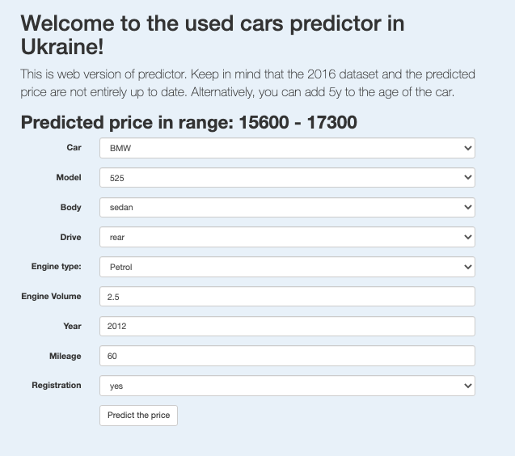

# Welcome to the project for forecasting prices for used cars in Ukraine

---
The goal of the project was to try to implement 
the final product in the form of a simple, but 
independent website with forecasting capabilities, 
or an embedded container that, upon request, could 
make a forecast and return results.

---
### This project uses such technologies:

---
* **Python** - the programming language.
* **XGBR** - the model performed best in comparison with the rest.
* **Flask** - web framework for managing the model using queries.
* **Docker** - allows you to pack in a container.
* **AWS** - deploying a docker-container with a project on Amazon servers.

---
### For EDA and Feature engineering:  

---
* **NumPy, Pandas** - for feature engineering.
* **Scikit-learn** - allows you to quickly find 
  the most suitable machine learning model for a specific project.
* **Matplotlib & Seaborn** - for EDA.

---
### Dataset

---
This is a [small dataset was found on Kaggle](https://www.kaggle.com/antfarol/car-sale-advertisements)
~ 9500 entries before preprocessing
and few features - 10 with target feature. Unfortunately, the dataset is for 2016 and therefore the application 
cannot give a relevant forecast for now. But you can try adding 5 years to the age of the car and this information 
will become a little more relevant.

---
### Prediction accuracy

---
After all the manipulations with the dataset 
and the selection of model parameters, it turned out to achieve 
an accuracy of 87% for cross-validation and 85% for the test sample.
Which means you can get the approximate cost of your car +/- 7%.  

These were models without any tuning, the best of them were chosen 
for further GridSearch of parameters. 
These models are random forest and gradient boosting. Already after 
fully tuning them, it turned out to achieve slightly better accuracy. 
And in the final version, the gradient boosting model was retained. 
I suppose it will be difficult to achieve noticeably better results on 
such a small dataset.  
It is also necessary to take into account that the dataset has about 850
different models and after processing the dataset there are only no more 
than 10 records left on the models, and often much less, since popular 
models can have about 100 records, and more rare ones only a couple.  
However, the application is ready to work with other, larger datasets after
a little modification. Ideally, of course, it would be to write a parser that 
would update the data weekly and the application would automatically retrain 
the model on it. But this is still a demo version of the project.

---
### Docker & Flask

---
#### The project has 2 versions:

* Web version with an expanded website on the AWS, prepackaged in a container, which allows
  you to conveniently make a single request to the server and find 
  out the cost of a specific car.
  

* The version that works with requests, which accepts external requests to the 
  "\<address\>/predict" address and extracts data in the json format from the request, after 
  which the dataset is preprocessed, a forecast is made, which is again packed into json and 
  flask the server makes a response with the result.

---
### Links

---
**[Web version, deployed on AWS](http://usedcarsua-env.eba-wy63zwqy.us-east-1.elasticbeanstalk.com/)**

---

Docker repository:
* Web version: **huginnm/used_cars_ua:web_version**
* Request version: **huginnm/used_cars_ua:latest**

